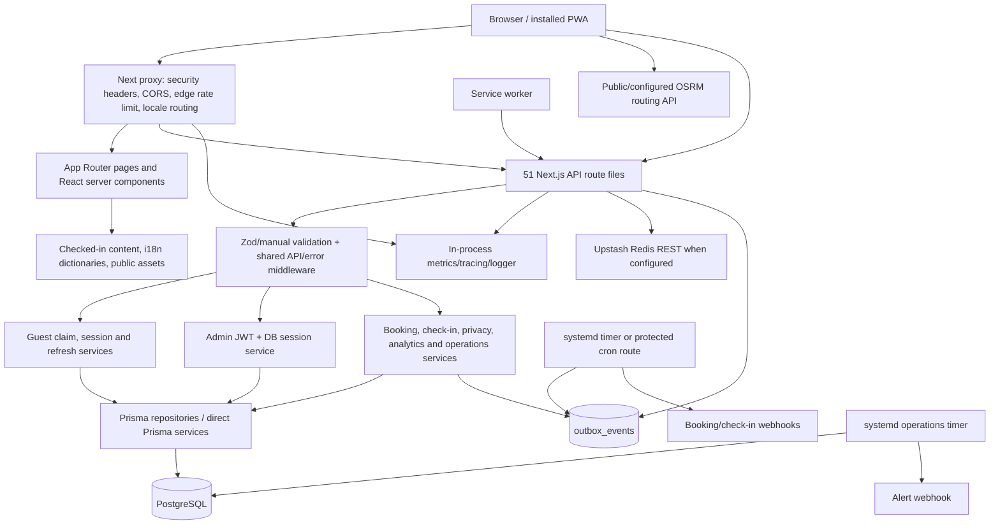

# 01 — System Architecture and Repository Map

## Scope and evidence

- **Review stage:** First-stage technical reconnaissance only; this is not a complete vulnerability audit and contains no remediation.
- **Review date:** 2026-07-15 (Europe/Athens).
- **Repository state:** `main`, aligned with `origin/main`; the tracked working tree was clean before the review and before this report was created.
- **Inventory scope:** 421 repository files after excluding dependency directories, `.next`, coverage, build output, caches, and other generated artifacts. Local environment files were identified by filename only; their values were not printed or copied. Only `.env.example` is tracked (`.gitignore:34-36`, `.env.example:1-62`).
- **Evidence notation:** `path:line-line` points to the live source inspected during this review. Generated Prisma client code is not used as authoritative architecture evidence; `prisma/schema.prisma` and migrations are.
- **Changes made:** This report is the only file created. No application code, dependency, migration, schema, database data, external resource, email, webhook, or payment action was changed or invoked.

## 1. Executive overview

This repository is a **single-package, full-stack Next.js application**, not a monorepo. It serves a bilingual (`en`, `el`) guest guide/PWA, a public booking-request form, an authenticated guest portal and check-in workflow, and administrator/operations pages. The same Next.js deployment contains React UI, server components, 51 API route files, authorization checks, business services, Prisma repositories, observability endpoints, and operational controls (`README.md:1-14`, `src/i18n/config.ts:1-3`, `next.config.ts:3-17`).

The durable system of record is PostgreSQL through Prisma 7 and the `@prisma/adapter-pg` adapter. The application has two custom authentication domains:

1. **Guest portal:** a host/admin issues a short-lived one-time booking claim token. A guest consumes it with a phone number, password, origin, and terms acceptance. The server creates or reuses the user, claims the booking, records terms and an audit event, then issues a short-lived JWT backed by a database `Session`; optional “remember me” uses a rotating, database-backed refresh-token family (`src/lib/portalAuthService.ts:44-85`, `src/lib/portalAuthService.ts:88-208`, `src/lib/guestSession.ts:61-129`, `src/lib/portalAuthHttp.ts:24-50`).
2. **Administrator:** a configured shared dashboard secret is exchanged for an HS256 JWT backed by an `AdminSession` row. Sliding refresh remains bounded by a 24-hour absolute server-side expiry (`src/app/api/admin/login/route.ts:9-58`, `src/lib/auth/admin.ts:81-135`).

Booking requests and check-in arrival requests use a **transactional database outbox**. API handlers persist both the aggregate and outbox event, try immediate delivery, and rely on a leased/retrying worker for recovery. A separate operational worker evaluates alert rules and applies retention (`src/app/api/booking-requests/route.ts:82-128`, `src/lib/bookingOutbox.ts:28-190`, `src/lib/operationalMonitor.ts:110-225`).

There is **no payment processor, payment initiation/confirmation handler, executable refund flow, email provider, email verification flow, password-reset flow, file-upload endpoint, object-storage integration, or general-purpose message-broker dependency** in the repository. The word “refund” appears in localized booking-policy content, not executable payment code. External runtime integrations found in code are PostgreSQL, optional Upstash Redis REST for distributed edge rate limiting, OSRM routing from the browser, and configured booking/check-in/alert webhooks (`package.json:79-100`, `src/lib/upstash.ts:1-8`, `src/lib/osrmClient.ts:69-83`, `src/lib/bookingOutbox.ts:8-19`).

Primary deployment artifacts target a Next.js standalone Node process, a multi-stage non-root Docker image, and hardened systemd services/timers. The actual live hosting platform and topology cannot be proved from the repository (`next.config.ts:3-5`, `docker/Dockerfile.security:18-62`, `deploy/systemd/qr-city-guide.service:1-43`).

The strongest first-stage concerns are areas requiring deeper proof, not confirmed vulnerabilities: custom auth/session correctness, route-by-route authorization consistency, public database-writing ingestion endpoints, privacy erasure transactions, webhook/outbox delivery semantics, production migration rehearsal, production proxy/rate-limit configuration, missing automated CI enforcement, and absence of live-database/integration/E2E coverage.

## 2. Repository structure

| Area | Contents and responsibility | Evidence |
|---|---|---|
| Root package | One private npm package; runtime/scripts/dependencies; Next, TypeScript, ESLint, Vitest and Prisma configuration | `package.json:1-10`, `package.json:11-77`, `next.config.ts:1-29`, `tsconfig.json:1-42`, `vitest.config.ts:1-74` |
| `src/app` | Next.js App Router pages, layouts, metadata, locale routes, admin UI and all HTTP route handlers | `src/app/layout.tsx:30-60`, `src/app/[locale]/layout.tsx:14-85`, `src/lib/openapi.ts:159-368` |
| `src/components`, `src/hooks`, `src/styles` | React client/server UI, forms, PWA/runtime managers, maps, analytics/vitals reporters and CSS layers; 61 authored modules declare `use client` | `src/components/BookingForm.tsx:1-30`, `src/hooks/useGuestSession.ts:1-60`, `src/app/globals.css` |
| `src/lib` | Auth/session services, API/security middleware, validation, Prisma client/repositories, outbox, privacy, analytics, logging, metrics, tracing, rate limiting, caching and utility code | `src/lib/portalAuthService.ts`, `src/lib/security-middleware-edge.ts`, `src/lib/prisma.ts`, `src/lib/bookingOutbox.ts` |
| `src/data`, `src/i18n`, `src/config` | Checked-in public content, Zod schemas, categories, maps and immutable English/Greek dictionaries | `src/lib/data.ts:9-77`, `src/data/schemas.ts:1-66`, `src/i18n/dictionaries.ts:52-103` |
| `prisma` | Canonical PostgreSQL schema, generated-client target and 14 version-controlled migration directories | `prisma/schema.prisma:1-8`, `prisma/schema.prisma:10-472`, `prisma.config.ts:15-24` |
| `public` | Static images/icons, web manifest, service worker and generated precache/version artifacts | `public/sw.js:33-33`, `public/sw.js:483-502`, `.gitignore:70-72` |
| `scripts` | Environment/bootstrap orchestration, migration runner, outbox and operations workers, validation/security/license/content/browser checks, standalone preparation and systemd installation | `package.json:42-77`, `scripts/README.md:56-129` |
| `tests` | 14 Vitest files: 4 unit, 7 security, 2 component and 1 public-route contract file | `vitest.config.ts:12-24`, `docs/testing.md:11-18` |
| `docker`, `deploy/systemd` | PostgreSQL Compose definitions, production app Dockerfile, app/bootstrap services, and outbox/operations timers | `docker-compose.yml:1-25`, `docker/docker-compose.prod.yml:1-25`, `deploy/systemd/qr-city-guide-outbox.timer:1-12` |
| `.github` | Dependabot configuration and Copilot instructions; **no GitHub Actions workflows** | `.github/dependabot.yml:1-55`, `README.md:28-40` |
| `docs`, `README.md`, `SECURITY.md` | Setup/runtime, testing policy, migration rehearsal, backup expectations and secret incident guidance | `README.md:16-58`, `docs/deployment-migration-rehearsal.md:1-108`, `SECURITY.md:1-52` |
| Environment files | `.env.example` is tracked; `.env.development.local` and `.env.local` exist locally and are ignored. Values were not inspected or reported | `.gitignore:34-36`, `.env.example:1-62` |

There are no separate workspace packages, native mobile applications, independent backend service, Terraform/Kubernetes manifests, or checked-in cloud-provider pipeline definitions.

## 3. Technology stack

| Concern | Confirmed technology | Evidence |
|---|---|---|
| Languages | TypeScript/TSX, JavaScript/ESM, CSS, SQL, Bash, YAML and Markdown | `package.json:5`, `tsconfig.json:3-18`, `prisma/migrations/000_init/migration.sql`, `scripts/system-orchestrator.sh` |
| Runtime | Active review runtime Node `v22.19.0`, npm `11.18.0`; repository requires Node >=22.19 and npm >=11.18 | `.nvmrc:1`, `package.json:6-10` |
| Package manager | npm with lockfile v3; no Yarn/pnpm/Bun lockfile | `package.json:6`, `package-lock.json:1-6` |
| Frontend | Next.js 16.2.x App Router, React/React DOM 19.2.x, React Hook Form, Zod resolvers, Framer Motion, Leaflet, Tailwind 4 through PostCSS | `package.json:80-99`, `package.json:101-131`, `postcss.config.mjs` |
| Backend/API | Next.js route handlers running in the same deployment; shared error/security middleware and Node services | `src/lib/openapi.ts:159-368`, `src/lib/apiErrorHandler.ts`, `src/proxy.ts:22-85` |
| ORM/database client | Prisma 7 generated client with `@prisma/adapter-pg` and `pg` | `package.json:81-83`, `package.json:93`, `src/lib/prisma.ts:1-7`, `src/lib/prisma.ts:139-165` |
| Database | PostgreSQL; Compose pins PostgreSQL 16 Alpine | `prisma/schema.prisma:6-8`, `docker-compose.yml:1-17` |
| Guest auth | Custom host-issued claim tokens, bcrypt password hashes, HS256 JWT, database sessions and rotating refresh-token families | `src/lib/portalAuthService.ts:8-34`, `src/lib/portalAuthService.ts:88-208`, `src/lib/guestSession.ts:20-47`, `src/lib/prisma-repositories/refreshTokenRepository.ts:229-383` |
| Admin auth | Configured shared dashboard secret, HS256 JWT and database `AdminSession`; not an external identity provider | `src/app/api/admin/login/route.ts:13-55`, `src/lib/auth/admin.ts:29-79`, `src/lib/auth/admin.ts:81-135` |
| Authorization | Per-route admin checks, verified guest-session checks, and self-or-admin DSAR check; no global RBAC framework beyond these helpers | `src/lib/rbac.ts:4-13`, `src/lib/adminPageAuth.ts:5-11`, `src/lib/guestSession.ts:83-116` |
| Payment/refund | None implemented | No provider dependency in `package.json:79-100`; no payment route in `src/lib/openapi.ts:159-368` |
| Email | None implemented; no SMTP/email-provider dependency or sender service | `package.json:79-100` |
| File storage/uploads | Checked-in static assets and local data only; no multipart/upload route or object-storage SDK | `src/lib/data.ts:9-33`, API inventory below |
| Queue/background jobs | PostgreSQL outbox with leases/retries; systemd timers and optional protected HTTP cron trigger. No BullMQ/Kafka/RabbitMQ/SQS | `src/lib/bookingOutbox.ts:6-10`, `src/lib/bookingOutbox.ts:28-190`, `deploy/systemd/qr-city-guide-outbox.timer:1-12` |
| Shared external services | Optional Upstash Redis REST, outbound webhooks, public OSRM routing | `src/lib/upstash.ts:1-8`, `src/lib/bookingOutbox.ts:12-19`, `src/lib/osrmClient.ts:77-83` |
| Hosting/deployment | Next standalone output, non-root Docker image, systemd app/bootstrap/worker units; production topology itself unknown | `next.config.ts:3-5`, `docker/Dockerfile.security:18-62`, `deploy/systemd/qr-city-guide.service:1-43` |
| Tests | Vitest 4.1, Testing Library, jsdom on component tests, V8 coverage; optional Puppeteer/Lighthouse/axe browser audits | `package.json:101-131`, `vitest.config.ts:12-73`, `docs/testing.md:11-33` |
| Logging/monitoring | Custom structured console logger, custom tracing, in-process metrics, database analytics/vitals/security events/alerts, health/readiness endpoints. No configured third-party APM/error-monitoring exporter was found | `src/lib/logger-enterprise.ts:73-126`, `src/lib/logger-enterprise.ts:259-311`, `src/lib/metrics-collector.ts:104-159`, `src/app/api/health/ready/route.ts:13-90` |

## 4. Architecture diagram

The frontend communicates with the backend through same-origin `/api/*` fetches, cookies and beacons. A common client wrapper adds same-origin credentials and correlation IDs (`src/lib/internalFetchClient.ts:38-95`). The service worker only handles public category reads and queues analytics; it avoids other API paths (`public/sw.js:33-33`, `public/sw.js:483-502`).

## 5. Component responsibilities and dependencies

| Component | Responsibility | Main dependencies |
|---|---|---|
| Locale/public guide | Static/server-rendered bilingual pages, category/item content, apartment and local guide UI | `src/app/[locale]`, `src/i18n`, `src/data`, `src/lib/data.ts` |
| Browser/PWA layer | Forms, maps, offline/cache behavior, analytics and Web Vitals submission, session polling/refresh | React client components, `public/sw.js`, `/api/categories`, `/api/analytics`, `/api/vitals` |
| Edge proxy | CSP nonce and security headers, CORS, general API rate limiting, tracing, locale redirects | `src/proxy.ts:22-197`, `src/lib/security-middleware-edge.ts:175-420` |
| API boundary | HTTP methods, bounded JSON parsing, Zod/manual validation, structured errors, route authorization | `src/app/api`, `src/lib/apiErrorHandler.ts`, `src/lib/api-security-middleware.ts` |
| Guest identity/access | Claim grants, phone/password identity, JWT + DB session, refresh rotation/replay detection | `portalAuthService`, `guestSession`, `portalAuthHttp`, `refreshTokenRepository` |
| Admin identity/access | Shared-secret login, JWT verification, DB session expiry/revocation, admin page redirect | `src/lib/auth/admin.ts`, `src/lib/adminPageAuth.ts`, `src/lib/rbac.ts` |
| Guest/store layer | Domain mapping and repository facade for users, bookings, check-ins and refresh tokens | `src/lib/guestDataStore.ts:35-254`, `src/lib/prisma-repositories/*` |
| Booking/check-in delivery | Durable aggregate writes, outbox creation, leasing, retries, webhook delivery | `src/app/api/booking-requests/route.ts`, `checkInRequestRepository`, `bookingOutbox` |
| Privacy | Self/admin exports, verified erasure requests, holds and transactional anonymization/deletion | `src/app/api/dsar`, `src/app/api/admin/privacy-requests`, `src/lib/privacyService.ts` |
| Analytics/operations | Privacy-minimized analytics/vitals, custom metrics, security events, alerts and retention | `analyticsRepository`, `metrics-collector`, `security-monitoring`, `operationalMonitor` |
| Persistence | Prisma client, repositories, explicit transactions and PostgreSQL migrations | `src/lib/prisma.ts`, `prisma/schema.prisma`, `prisma/migrations` |
| Deployment control plane | Env validation, DB checks, migration/build/start/verify sequencing, Docker and systemd workers | `instrumentation.ts:7-23`, `scripts/system-orchestrator.sh`, `deploy/systemd`, `docker` |

Configuration is environment-driven. The authoritative schema validates database/auth/encryption/Wi-Fi settings, production HTTPS, trusted proxy topology, paired webhook URL/token values, and production Redis rate limiting (`src/lib/runtime-env-schema.js:31-86`, `src/lib/runtime-env-schema.js:87-163`). Development loads local overrides; production intentionally excludes `.env.local` (`prisma.config.ts:4-13`, `scripts/README.md:29-34`).

## 6. Critical data flows

### 6.1 Registration / guest signup (host-issued booking claim)

- **Entry point:** UI `src/app/[locale]/guest/UnifiedGuestClient.tsx:85-103` posts to `POST /api/portal/claims`.
- **Validation:** JSON limited to 16 KiB; Zod requires a 32–256 character claim token, origin, bounded phone/password, optional remember flag and literal terms acceptance; sensitive rate limit is five attempts/hour per IP and normalized phone (`src/app/api/portal/claims/route.ts:15-39`).
- **Authentication proof:** no existing login is required; possession of an unexpired, unrevoked, unconsumed host-issued claim grant plus valid account credentials is the proof.
- **Database/authorization:** token is HMAC-digested; a serializable transaction validates the grant/booking window, creates or reuses the phone-unique user, verifies/sets bcrypt password, prevents cross-user booking claims, atomically consumes the grant, claims the booking, revokes sibling grants, upserts terms acceptance and writes a security audit event (`src/lib/portalAuthService.ts:88-208`).
- **Session/side effects:** creates a database `Session` and `guest_session` HttpOnly cookie; with remember enabled, creates a refresh-token family and `guest_rt` cookie (`src/lib/portalAuthHttp.ts:24-50`).
- **Error handling:** known conflicts become 409; invalid claim/credentials become a generic 401; unexpected errors use the shared handler (`src/app/api/portal/claims/route.ts:43-69`).

There is no open public reservation-lookup signup. The compatibility `/api/portal/verify` accepts only sign-in mode and returns 410 for former signup modes (`src/app/api/portal/verify/route.ts:8-37`).

### 6.2 Email verification

No email-verification token model, route, sender, or provider exists. Guest identity is phone/password plus a booking claim grant. `User.email` is optional and is not the portal login identifier (`prisma/schema.prisma:10-16`, `src/lib/portalAuthService.ts:211-245`).

### 6.3 Login

- **Guest:** `POST /api/portal/sessions`; 16 KiB Zod-validated phone/password/remember body, five attempts/15 minutes, bcrypt verification, then selection of an owned `VERIFIED` booking active today or within seven days (`src/app/api/portal/sessions/route.ts:15-63`, `src/lib/portalAuthService.ts:211-245`). Session and optional refresh cookies are attached as in signup.
- **Admin:** `POST /api/admin/login`; Zod-validates a token, rate-limits through PostgreSQL, compares against `ADMIN_DASH_SECRET` with `timingSafeEqual`, creates an `AdminSession`, signs a two-hour JWT and sets a `SameSite=Strict` HttpOnly cookie (`src/app/api/admin/login/route.ts:9-58`).

### 6.4 Logout

- **Guest:** `POST /api/portal/logout` revokes the current DB session and entire refresh-token family when present, clears both cookies and returns 204 (`src/app/api/portal/logout/route.ts:8-21`).
- **Admin:** `POST /api/admin/logout` verifies the JWT enough to obtain the session id, revokes that DB session, clears the cookie and returns success. It is deliberately idempotent even without a valid cookie (`src/app/api/admin/logout/route.ts:7-23`).

### 6.5 Password reset

No password-reset request, reset-token model, password-change endpoint, or email/SMS delivery flow exists. `guestStore.updateUserPassword` exists as an internal facade method but no route invokes it (`src/lib/guestDataStore.ts:60-64`).

### 6.6 Session/token refresh

- **Guest:** `POST /api/portal/refresh` reads `guest_rt`, rotates the token inside its family, detects concurrent rotation and replay, verifies that an eligible booking still exists, issues a new DB-backed short JWT session, revokes the previous short session, and sets new cookies. Missing/failed refresh clears cookies; concurrent refresh returns retryable 409 (`src/app/api/portal/refresh/route.ts:47-155`, `src/lib/guestDataStore.ts:204-234`).
- **Admin:** `POST /api/admin/refresh` verifies JWT and DB session, refreshes the sliding two-hour DB expiry without crossing the 24-hour absolute expiry, signs a new JWT and replaces the cookie (`src/app/api/admin/refresh/route.ts:8-58`, `src/lib/auth/admin.ts:98-125`).

### 6.7 Public booking-request creation

- **Entry:** `BookingForm` generates an idempotency UUID and posts guest/date/property data to `POST /api/booking-requests` (`src/components/BookingForm.tsx:71-108`).
- **Validation/auth:** public endpoint; requires configured booking webhook, valid 16–128 character idempotency header, 32 KiB bounded JSON, Zod fields/date ordering, normalized phone and DB-backed sensitive rate limit (`src/app/api/booking-requests/route.ts:13-80`).
- **Database:** returns an existing request for a repeated key; otherwise creates `StayRequest` and related `OutboxEvent` in one nested Prisma write, handling unique-key races (`src/app/api/booking-requests/route.ts:82-125`).
- **Side effects/error handling:** attempts the webhook after durable commit; success or failure is represented by outbox state and a 202 queued response (`src/app/api/booking-requests/route.ts:127-128`, `src/lib/bookingOutbox.ts:28-147`). This is a request/enquiry, not a payment or confirmed reservation.

### 6.8 Reading and updating guest/check-in data

- **Read booking/check-in:** `GET /api/check-in` requires an active verified guest JWT+DB session+booking relationship and reads booking/completion through `guestStore` (`src/app/api/check-in/route.ts:9-46`, `src/lib/guestSession.ts:83-116`).
- **Complete check-in:** `POST /api/check-in/complete` validates HH:mm, bounded special requests and terms acceptance, requires verified guest booking access, then Prisma-upserts one `Checkin` per booking (`src/app/api/check-in/complete/route.ts:12-47`, `src/lib/prisma-repositories/checkinRepository.ts:12-34`).
- **Arrival request:** `GET` reads the latest request owned by the guest. `POST` validates time/message, persists a `CheckInRequest` plus optional outbox notification, prevents duplicate pending requests through a DB uniqueness invariant, then attempts webhook delivery (`src/app/api/check-in/arrival-request/route.ts:32-99`, `src/lib/prisma-repositories/checkInRequestRepository.ts:65-129`).
- **Preferences/Wi-Fi:** guest or admin may read; Wi-Fi is always shown to admin and time-gated for a verified booking. Only admin may update operational preferences (`src/app/api/check-in/preferences/route.ts:55-107`, `src/app/api/check-in/preferences/route.ts:110-142`).

### 6.9 Admin/privileged operations

Admin route handlers independently verify the `admin_jwt` server-side; frontend page protection is not treated as sufficient. Main operations are guest/booking search/export, claim-grant issuance, check-in request approval/rejection, stay-request delivery retry/closure, feature flags, privacy actions, analytics/vitals exports, alerts and security dashboard (`src/lib/rbac.ts:4-8`, `src/app/api/admin/bookings/[id]/claim-grants/route.ts:15-40`, `src/lib/openapi.ts:291-343`). Claim-grant plaintext is returned once; only its HMAC digest is stored (`src/lib/portalAuthService.ts:44-85`).

### 6.10 Privacy export and erasure

- `GET /api/dsar/export` requires either the active subject or an admin, gathers the subject footprint and records an `EXPORT` privacy request before returning a JSON attachment (`src/app/api/dsar/export/route.ts:14-126`).
- `POST /api/dsar/requests` requires a verified guest session, rate-limits and accepts only explicit `ERASURE` confirmation; it creates/reuses a verified operator-review request (`src/app/api/dsar/requests/route.ts:9-49`).
- Admin completion runs a serializable transaction that checks holds/active delivery leases, cancels/redacts pending deliveries, anonymizes stay/check-in/booking data, revokes grants, deletes the user, completes the request and writes an audit event (`src/lib/privacyService.ts:46-200`).

### 6.11 Analytics, errors and operational ingestion

Browser analytics and Web Vitals are sent by beacon/fetch and may be queued by the service worker. Public handlers bound size/rate, allowlist/sanitize fields and write `AnalyticsHit`, `AnalyticsVital` or `SecurityAuditEvent`; read/export operations require admin (`src/app/api/analytics/route.ts:35-166`, `src/app/api/vitals/route.ts:10-62`, `src/app/api/errors/route.ts:11-58`). CSP reports are similarly bounded and rate-limited (`src/app/api/security/csp-report/route.ts:25-60`).

### 6.12 Webhooks and background operations

The outbox worker claims due events with a five-minute lease, posts an idempotency key, marks delivery transactionally, retries with exponential backoff up to ten attempts, recovers expired leases and ends exhausted events as `DEAD` (`src/lib/bookingOutbox.ts:6-10`, `src/lib/bookingOutbox.ts:28-190`). It runs each minute under systemd or through a cron-secret-protected route (`deploy/systemd/qr-city-guide-outbox.timer:5-9`, `src/app/api/internal/booking-outbox/route.ts:7-19`).

The five-minute operations worker upserts/evaluates alert rules, sends/retries alert webhooks, resolves recovered alerts and deletes expired operational/analytics/auth records according to retention windows (`deploy/systemd/qr-city-guide-operations.timer:5-9`, `src/lib/operationalMonitor.ts:110-225`).

### 6.13 Payments, refunds, uploads and email

No executable flows exist for payment initiation, payment confirmation, payment webhooks, refunds, file uploads or email sending. These items should be marked **not applicable to the current repository**, not “untested implemented flows.”

## 7. Database overview

### 7.1 Models, keys and relationships

All model primary keys are explicit. Most business entities use application-generated UUID strings; `Checkin.bookingId`, `OperationalSetting.key` and `RateLimit.key` are natural/specialized primary keys.

| Models | Primary/unique constraints | Important relationships and indexes | Evidence |
|---|---|---|---|
| `User` | UUID PK; unique optional email; unique E.164 phone | One-to-many bookings, sessions, refresh families/tokens, requests, terms and privacy records; phone/country, email/password and timestamps indexed | `prisma/schema.prisma:10-33` |
| `Booking` | UUID PK; unique `(provider, externalReference)` | Optional owner; one check-in; many sessions, check-in requests, claim grants, terms/privacy; date/owner/source/access indexes | `prisma/schema.prisma:35-66` |
| `Session` | UUID PK | Required user+booking FKs, cascade delete; expiry/revocation and created-time indexes | `prisma/schema.prisma:68-83` |
| `Checkin` | `bookingId` PK/FK | One-to-one booking, cascade delete; accepted time indexed | `prisma/schema.prisma:85-95` |
| `CheckInRequest` | UUID PK | Optional booking/user FKs (`SetNull`), outbox events; booking/user/status-time indexes | `prisma/schema.prisma:97-117` |
| `BookingClaimGrant` | UUID PK; unique token digest | Booking and optional issuing admin-session FKs; booking/expiry and cleanup indexes | `prisma/schema.prisma:119-135` |
| `StayRequest` | UUID PK; unique idempotency key | Outbox events; status/time and email indexes | `prisma/schema.prisma:137-158` |
| `OutboxEvent` | UUID PK; unique idempotency key | Optional stay/check-in request FKs; delivery, lease, aggregate and request indexes | `prisma/schema.prisma:160-187` |
| `OperationalSetting` | String key PK | JSON runtime settings | `prisma/schema.prisma:189-195` |
| `AdminSession` | UUID PK | Optional claim grants; sliding/absolute expiry indexes | `prisma/schema.prisma:197-209` |
| `RefreshTokenFamily`, `RefreshToken` | String family PK; token UUID PK | Required user/family FKs; self-referential rotation history; expiry/revocation/hash/active indexes | `prisma/schema.prisma:211-254` |
| `TermsAcceptance` | UUID PK; unique booking/user/version | Required booking+user FKs, cascade delete; accepted-time index | `prisma/schema.prisma:256-269` |
| `SecurityAuditEvent` | UUID PK | Event/severity time indexes; privacy-minimized metadata JSON | `prisma/schema.prisma:271-284` |
| `AlertRule`, `Alert` | UUID PKs; unique rule name | Alert→rule restrict-delete; enabled and status/opened indexes; migration also defines one unresolved alert/rule | `prisma/schema.prisma:286-319`, `prisma/migrations/20260714150000_trustworthy_portal_and_operations/migration.sql:239-259` |
| `AnalyticsHit`, `AnalyticsVital` | UUID PKs; unique optional analytics event id | Occurrence/path/name time indexes | `prisma/schema.prisma:321-346` |
| `PrivacyRequest`, `PrivacyHold` | UUID PKs | Optional user/booking FKs; status/subject/hold indexes; migration enforces one open erasure request/user | `prisma/schema.prisma:348-380`, `prisma/migrations/20260715104000_unique_open_erasure_request/migration.sql:1-24` |
| `RateLimit` | String key PK | Reset/count indexes; atomic raw-SQL increment | `prisma/schema.prisma:382-390`, `src/lib/sensitiveRateLimit.ts:38-69` |
| `Metric`, `Log` | UUID PKs | Name/level/time indexes; retained for 30 days by operations worker | `prisma/schema.prisma:392-414`, `src/lib/operationalMonitor.ts:191-225` |

Additional database-only partial unique constraints include one pending check-in request per booking and one unresolved alert per rule; these are declared in migrations because Prisma schema syntax does not represent their predicates (`prisma/migrations/20260714150000_trustworthy_portal_and_operations/migration.sql:259-325`).

### 7.2 Migrations, seeds and schema synchronization

- There are 14 ordered, version-controlled migration directories from `000_init` through `20260715110000_remove_unused_legacy_models`. Recent migrations include ownership preservation/enforcement, trusted portal/outbox/privacy structures, phone normalization, analytics idempotency, booking update timestamps, unique open erasure requests, lease recovery and guarded legacy-table removal.
- No seed script or Prisma seed configuration was found.
- `postinstall` runs **only** `prisma generate`; it does not apply schema changes (`package.json:12-18`).
- The Next.js instrumentation hook validates environment configuration only and explicitly skips build/export; it does not migrate (`instrumentation.ts:7-23`).
- `system:up`/`bootstrap` can apply `prisma migrate deploy` unless `--skip-migrate` is passed. The documented production sequence separates check, migrate, build, and start; the systemd bootstrap unit runs the bootstrap/migration gate before the app service (`scripts/README.md:95-107`, `deploy/systemd/qr-city-guide-bootstrap.service:6-14`, `deploy/systemd/qr-city-guide.service:3-16`).
- No `prisma db push` or other non-versioned schema-sync command is defined. `prisma migrate dev` exists as an explicit developer command and was not executed (`package.json:15-17`).
- Readiness verifies the latest expected migration row, not only `SELECT 1` (`src/app/api/health/ready/route.ts:6-31`).
- Migrations are forward-only. The rehearsal runbook requires a backup/clone and contains explicit guards for ownership preservation and non-empty legacy tables (`docs/deployment-migration-rehearsal.md:35-108`).

### 7.3 Transactions, deletion and tenancy

Serializable or atomic transactions protect claim consumption, refresh rotation, check-in status/outbox creation, privacy erasure, stay-request actions, security monitoring, retention and readiness (`src/lib/portalAuthService.ts:103-205`, `src/lib/prisma-repositories/refreshTokenRepository.ts:229-383`, `src/lib/privacyService.ts:46-200`).

The schema has status/revocation timestamps (`revokedAt`, `consumedAt`, `releasedAt`, `deliveredAt`) for operational lifecycle records, but no universal soft-delete convention. Privacy erasure includes real `User` deletion plus anonymization/unlinking of related records (`src/lib/privacyService.ts:125-198`). No tenant id, tenant relation, row-level security definition or multi-tenant routing logic was found; the system appears single-property/single-operator from repository evidence.

## 8. API inventory

The table covers all 51 route files. “Public” means the handler itself does not require a logged-in principal; it may still require a claim, bearer/API secret, feature flag or rate limit. “DB session” means authorization is checked against both a signed cookie and server-side session state.

| Method | Route | Handler | Authentication | Authorization | Validation | Database access | External side effects |
|---|---|---|---|---|---|---|---|
| GET/HEAD | `/api/health`, `/api/health/live` | `src/app/api/health*/route.ts` | Public | Public liveness only | None | None | None |
| GET/HEAD | `/api/health/ready` | `src/app/api/health/ready/route.ts:13-90` | Public | Public readiness | Fixed timeouts/latest migration | PostgreSQL migration check | Upstash ping when required |
| GET | `/api/categories` | `src/app/api/categories/route.ts` | Public | Public content | Static schema/data layer | Filesystem JSON | None |
| GET | `/api/categories/[category]/items` | `src/app/api/categories/[category]/items/route.ts` | Public | Public content | Validated/constrained category | Filesystem JSON | None |
| GET | `/api/categories/[category]/items/[slug]` | `src/app/api/categories/[category]/items/[slug]/route.ts` | Public | Public content | Validated category/slug | Filesystem JSON | None |
| POST | `/api/booking-requests` | `src/app/api/booking-requests/route.ts:13-128` | Public | None; feature requires webhook | Idempotency header, Zod, phone, dates, rate limit | `RateLimit`, `StayRequest`, `OutboxEvent` | Booking webhook attempt |
| POST | `/api/portal/start` | `src/app/api/portal/start/route.ts:13-80` | Public | Portal feature flag | Shared content-type/size guard | `OperationalSetting` flag read | Returns form schema |
| POST | `/api/portal/claims` | `src/app/api/portal/claims/route.ts:15-69` | Claim token + phone/password | Grant must match eligible unclaimed/owned booking | Zod, 16 KiB, rate limit | User/booking/grant/terms/audit/session/refresh | Sets guest cookies |
| GET | `/api/portal/sessions` | `src/app/api/portal/sessions/route.ts:21-30` | Guest JWT + DB session | Active owned eligible booking | Cookie/JWT/session checks | Session, booking, feature flag | None |
| POST | `/api/portal/sessions` | `src/app/api/portal/sessions/route.ts:32-64` | Phone/password | User must own eligible verified booking | Zod, 16 KiB, rate limit | User, booking, session, refresh | Sets guest cookies |
| POST | `/api/portal/refresh` | `src/app/api/portal/refresh/route.ts:69-155` | Refresh cookie | Active non-replayed family + eligible booking | Safe local redirect, rotation rules | Refresh family/token, user, booking, session | Rotates/clears cookies |
| POST | `/api/portal/logout` | `src/app/api/portal/logout/route.ts:8-21` | Optional guest cookies | Idempotent self-logout | Cookie parsing | Session/family revocation | Clears cookies |
| POST | `/api/portal/verify` | `src/app/api/portal/verify/route.ts:8-37` | Sign-in credentials only | Deprecated signup modes denied | 16 KiB body, mode check | Via sessions handler | Cookies if forwarded login succeeds |
| POST | `/api/portal/onsite/confirm` | `src/app/api/portal/onsite/confirm/route.ts` | Public | Removed endpoint | None | None | Always 410 |
| POST | `/api/portal/dev-mint-session` | `src/app/api/portal/dev-mint-session/route.ts:21-43` | Non-production dev secret | Exact user owns verified booking | Zod UUID body | Booking, session | Sets guest session cookie |
| GET | `/api/check-in` | `src/app/api/check-in/route.ts:9-46` | Guest JWT + DB session | Active owned booking; feature flag | Session invariants | Booking, check-in, flag | None |
| GET/POST | `/api/check-in/arrival-request` | `src/app/api/check-in/arrival-request/route.ts:32-99` | Guest JWT + DB session | Request constrained to session user/booking | Feature flag; Zod HH:mm/message; API guard | Check-in request, user, optional outbox | Check-in webhook attempt on POST |
| POST | `/api/check-in/complete` | `src/app/api/check-in/complete/route.ts:12-47` | Guest JWT + DB session | Session booking only | Zod time/terms/request length | Upsert `Checkin` | Metrics/tracing |
| GET | `/api/check-in/complete/get` | `src/app/api/check-in/complete/get/route.ts` | Guest JWT + DB session | Session booking only | Session checks | Read `Checkin` | None |
| GET | `/api/check-in/preferences` | `src/app/api/check-in/preferences/route.ts:55-107` | Guest DB session or admin DB session | Guest Wi-Fi time window; admin full read | Feature/session checks | Operational setting, booking | May return configured Wi-Fi secret to authorized caller |
| POST | `/api/check-in/preferences` | `src/app/api/check-in/preferences/route.ts:110-142` | Admin DB session | Admin only | API guard + Zod times | Upsert operational setting | None |
| GET | `/api/dsar/export` | `src/app/api/dsar/export/route.ts:14-126` | Guest DB session or admin DB session | Self subject or admin; subject query admin-only | UUID/phone query checks | User footprint + privacy audit row | JSON attachment |
| GET/POST | `/api/dsar/requests` | `src/app/api/dsar/requests/route.ts:9-49` | Guest DB session | Self only | POST explicit erasure confirmation + rate limit | Privacy requests, rate limit | None |
| POST/GET | `/api/analytics` | `src/app/api/analytics/route.ts:132-184` | POST public; GET admin DB session | Admin-only read | Size/rate/bot/allowlist normalization | Analytics hits, rate limit; admin vitals read | None |
| GET | `/api/analytics/stats`, `/api/analytics/top` | corresponding route files | Admin DB session | Admin only | Bounded query defaults | Analytics aggregate SQL | None |
| GET | `/api/analytics/export.csv` | `src/app/api/analytics/export.csv/route.ts:9-63` | Admin DB session | Admin only | Session cookie | Analytics aggregates | CSV attachment |
| POST/GET | `/api/vitals` | `src/app/api/vitals/route.ts:10-62` | POST public; GET admin DB session | Admin-only read | Zod, 16 KiB, rate limit | Vitals, rate limit | None |
| GET | `/api/vitals/export.csv` | `src/app/api/vitals/export.csv/route.ts:9-50` | Admin DB session | Admin only | Session cookie | Vitals | CSV attachment |
| POST | `/api/admin/login` | `src/app/api/admin/login/route.ts:9-58` | Dashboard shared secret | Admin role issued on match | Zod + timing-safe compare + rate limit | Rate limit, admin session | Sets admin cookie |
| POST | `/api/admin/logout` | `src/app/api/admin/logout/route.ts:7-23` | Optional admin cookie | Idempotent self-logout | JWT parse | Admin session revocation | Clears admin cookie |
| POST | `/api/admin/refresh` | `src/app/api/admin/refresh/route.ts:8-58` | Admin JWT + DB session | Active session within absolute TTL | Token shape/age/session | Admin session update | Replaces admin cookie |
| GET/POST | `/api/admin/flags` | `src/app/api/admin/flags/route.ts:11-38` | Admin DB session | Admin only | POST Zod partial booleans, 8 KiB | Operational setting read/upsert | Runtime feature change |
| GET | `/api/admin/guests` | `src/app/api/admin/guests/route.ts:24-175` | Admin DB session | Admin only | Action-specific query validation | Users/bookings/check-ins/requests | JSON export response for export action |
| GET | `/api/admin/check-in-requests` | `src/app/api/admin/check-in-requests/route.ts:12-56` | Admin DB session | Admin only | Status enum | Check-in request list/counts | None |
| PATCH | `/api/admin/check-in-requests/[id]` | `src/app/api/admin/check-in-requests/[id]/route.ts:12-68` | Admin DB session | Admin only | UUID + Zod status | Serializable request/outbox update | Check-in webhook attempt |
| GET | `/api/admin/stay-requests` | `src/app/api/admin/stay-requests/route.ts:10-38` | Admin DB session | Admin only | None | Stay requests + outbox delivery state | None |
| PATCH | `/api/admin/stay-requests/[id]` | `src/app/api/admin/stay-requests/[id]/route.ts:9-52` | Admin DB session | Admin only | Zod retry/close action | Transactional stay/outbox update | Requeues delivery; no direct fetch in handler |
| POST | `/api/admin/bookings/[id]/claim-grants` | `src/app/api/admin/bookings/[id]/claim-grants/route.ts:10-40` | Admin DB session | Admin only | UUID + Zod channel/TTL | Booking, claim grant, admin session | Returns plaintext token once |
| GET/POST | `/api/admin/privacy-requests` | `src/app/api/admin/privacy-requests/route.ts:10-83` | Admin DB session | Admin only | Status and discriminated action schema | Privacy requests/holds; serializable erasure | Destructive DB erasure only when explicitly requested |
| GET/POST/PUT/DELETE | `/api/alerts` | `src/app/api/alerts/route.ts:9-94` | Admin DB session | Admin only | UUID/rule update Zod | Alerts/rules/settings | DELETE intentionally rejected |
| GET/POST | `/api/alerts/webhook` | `src/app/api/alerts/webhook/route.ts:9-68` | GET public; POST bearer token | Token-authorized ingestion | Zod, 32 KiB, timing-safe token, rate limit | Alert/rule/rate-limit writes | None |
| POST | `/api/errors` | `src/app/api/errors/route.ts:11-58` | Public | None | Zod, 16 KiB, rate limit, redaction | Security audit event, rate limit | None |
| GET/POST | `/api/metrics` | `src/app/api/metrics/route.ts:103-459` | Admin cookie or configured API key; POST supports write keys | Read/write key policy | Zod queries/body/tags | Primarily in-process metrics | Mutates process-local metrics on POST |
| POST/OPTIONS | `/api/security/csp-report` | `src/app/api/security/csp-report/route.ts:25-65` | Public | None | Content type/size/Zod/rate limit | Security audit/rate limit | None |
| GET | `/api/security/dashboard` | `src/app/api/security/dashboard/route.ts:8-111` | Admin DB session | Admin only | Allowlisted view/query params | Security/alert/health data | None |
| POST | `/api/internal/booking-outbox` | `src/app/api/internal/booking-outbox/route.ts:7-19` | Cron bearer secret | Internal operator only | Timing-safe secret | Outbox/stay/check-in updates | Booking/check-in webhook deliveries |
| GET | `/api/internal/cache-metrics` | `src/app/api/internal/cache-metrics/route.ts:8-30` | Internal API key | Internal scope required | API-key format/scope | Dataset version snapshots | None |
| GET/POST | `/api/dev/alerts/verify-spike` | `src/app/api/dev/alerts/verify-spike/route.ts:9-82` | Non-production admin secret | Forbidden in production | Bounded numeric body | None | Mutates process-local synthetic metrics |
| GET | `/api/docs`, `/api/docs/openapi` | corresponding route files | Public | Public documentation | Escaped static spec rendering | None | HTML/JSON response |
| GET | `/api/og` | `src/app/api/og/route.ts:5-30` | Public | Public image generation | Title/subtitle length caps | None | Generated image response |

## 9. Existing tests and quality controls

| Control | Present state | Evidence / limitation |
|---|---|---|
| Unit tests | Present | 4 files; utilities/data/maps/date/phone/Prisma adapter (`docs/testing.md:11-18`) |
| Security/boundary tests | Present | 7 files covering env, auth/session, request bounds, proxy/rate limit, crypto, refresh and Upstash behavior |
| Component tests | Present | 2 jsdom files using Testing Library |
| Route contract tests | Present | 1 file for public health/OpenAPI/category contracts |
| Integration/live DB tests | Not present in default suite | Persistence/network are mocked; real PostgreSQL semantics remain an explicit boundary (`docs/testing.md:18-18`, `docs/testing.md:57-59`) |
| End-to-end tests | No committed E2E suite found | Puppeteer/Lighthouse/axe scripts are manual browser audits, not a product E2E test suite |
| Coverage | Configured but not run in this stage | Explicit authored-file allowlist and thresholds: lines 89%, functions 91%, branches 82%, statements 88% (`vitest.config.ts:25-73`) |
| Type checking | Strict TypeScript, no emit | `tsconfig.json:9-19`, `package.json:25` |
| Linting | Next/core-web-vitals/TypeScript plus dedicated security config | `eslint.config.mjs:1-34`, `eslint.config.security.mjs:1-96` |
| Formatting | No dedicated formatter/check script found | `package.json:11-77` |
| Static/dead code | Knip, conflict-marker checker, content/image/browser checks | `package.json:36-45`, `knip.json:1-10` |
| Dependency auditing | npm audit, license allowlist, Dependabot npm/Docker updates | `package.json:50-54`, `.github/dependabot.yml:1-55` |
| Secret scanning | Partial current-tree checks only | `validate:security` checks tracked/ignored secret files, but no dedicated history scanner/GitHub secret-scanning config is present (`scripts/validate-security.ts:35-75`, `scripts/validate-security.ts:141-168`) |
| Migrations | Version-controlled Prisma migrations, deployment lock/retry and rehearsal runbook | `prisma.config.ts:17-24`, `scripts/README.md:95-107`, `docs/deployment-migration-rehearsal.md:35-108` |
| Backups | Procedure documented, no automated backup job/config proved | `docs/deployment-migration-rehearsal.md:7-33` |
| Logging | Structured console logger, redaction utilities, DB security events/log model | `src/lib/logger-enterprise.ts`, `src/lib/redaction.ts`, `prisma/schema.prisma:271-284` |
| Error monitoring/APM | Custom ingestion/tracing only; no confirmed external exporter | `src/app/api/errors/route.ts:33-58`, `src/lib/logger-enterprise.ts:311-311` |
| Metrics | In-process collector plus DB analytics/vitals/operational models | `src/lib/metrics-collector.ts:104-159`, `src/lib/analyticsRepository.ts:17-44` |
| Health checks | Liveness and DB/migration/Redis readiness; Docker/systemd verification | `src/app/api/health/ready/route.ts:13-90`, `docker/Dockerfile.security:59-60` |
| Rate limiting | DB-backed sensitive endpoint limiter; Redis-backed edge limiter required in production | `src/lib/sensitiveRateLimit.ts:38-69`, `src/lib/runtime-env-schema.js:152-157` |
| Bot protection | Analytics user-agent filter and rate limits; no CAPTCHA/challenge provider | `src/app/api/analytics/route.ts:14-15`, `src/app/api/analytics/route.ts:132-150` |
| CI/CD gates | **No GitHub Actions workflows**; local scripts and deployment orchestration only | `README.md:28-40`, `docs/testing.md:1-18` |

## 10. Commands executed and results

No command below performed a migration, contacted production, sent a webhook/email/payment, or changed external resources.

| Command | Result | Warnings/failures |
|---|---|---|
| `git status --short --branch` | Pass; `main...origin/main`, clean before report | None |
| `node --version` / `npm --version` | `v22.19.0` / `11.18.0`, matches repository requirement | None |
| `npm run typecheck` | Pass | None |
| `npm run lint -- --max-warnings=0` | Pass | Zero warnings |
| `npm run lint:security` | Pass | Zero warnings |
| `npm test` | Pass: 14/14 files, 176/176 tests | None; 2.80 s reported |
| `npm run check:conflicts` | Pass | No unresolved merge conflict markers |
| `npm run check:dead-code` | Pass | Dotenv reported only counts of injected variables; no values were output |
| `npx prisma validate` | Pass | Schema valid; no database migration or connection performed |
| `npm audit --audit-level=high` | Pass | `found 0 vulnerabilities` |
| `npm run security:license-check` | Pass | All package licenses comply with allowlist |

One exploratory `rg` command used malformed zsh quoting while searching client API calls and printed a shell parse error. It did not alter files; the search was immediately repeated with a simpler quoted pattern and succeeded. **No validation command failed.**

### Deliberately not executed

| Command family | Reason |
|---|---|
| `npm run build`, `build:turbopack` | Their pipeline writes generated `public/precache.json`, `public/critical-precache.json`, `public/version.json` and `.next` (`package.json:22-23`, `scripts/generate-precache.ts:33-34`, `scripts/generate-version.ts:25`). This conflicts with the stage’s one-report-only creation constraint. |
| `npm run validate:security` | It invokes `npm run build` (`scripts/validate-security.ts:171-181`). Its safe constituent checks were covered separately where possible. |
| `npm run validate:local`, `npm run test:coverage` | They write coverage/build artifacts (`package.json:34`, `package.json:59`). |
| `system:*`, `db:*`, Prisma migrate commands | They can provision/start services, connect to configured databases, apply migrations or start the app. These were outside this read-only stage. |
| `outbox:drain`, `operations:check`, internal cron route | They mutate database state and can send configured webhooks. |
| Browser/Lighthouse/axe/responsive audits | They require a running server/browser and create report/screenshot artifacts. |
| Docker build/scan and systemd installation | They create images, run containers or modify host services. |
| `npm ci`, dependency fixes/outdated updates | Dependency installation/removal/update was prohibited. |

## 11. High-risk areas for deeper audit

These are **review priorities**, not claims of exploitable vulnerabilities.

1. **Guest claim and refresh state machine (highest priority):** prove concurrency, replay, session/booking expiry and cross-account invariants against a real PostgreSQL instance. The logic crosses claim grants, users, bookings, sessions, token families, cookies and serializable retry paths (`src/lib/portalAuthService.ts:88-208`, `src/lib/prisma-repositories/refreshTokenRepository.ts:229-383`).
2. **Admin authentication model:** assess the operational suitability of one shared dashboard secret, secret rotation, session invalidation, brute-force controls, CSRF assumptions and lack of named admin identities/MFA (`src/app/api/admin/login/route.ts:13-58`, `src/lib/auth/admin.ts:81-135`).
3. **Route authorization matrix:** verify every route and every action branch independently, especially admin guest exports, DSAR subject queries, metrics API-key scopes, Wi-Fi disclosure, dev-only endpoints and compatibility routes. Authorization is intentionally per-handler rather than globally declared.
4. **Input/abuse controls on public writes:** analytics, vitals, errors, CSP reports, booking requests and alert ingestion all write durable state. Test distributed-rate-limit failure modes, storage amplification, content-type enforcement, log injection/redaction and retention under hostile traffic.
5. **Webhook/outbox correctness:** verify destination ownership, token rotation, retry/idempotency contracts, lease recovery, shutdown behavior, timeout/backpressure, dead-letter operations and privacy erasure races (`src/lib/bookingOutbox.ts:28-190`).
6. **Privacy erasure transaction:** review legal/data-retention intent, all indirect identifiers, outbox races, partial failure semantics and downstream webhook copies. The transaction is complex and manually enumerates affected models (`src/lib/privacyService.ts:46-200`).
7. **Migration/data integrity:** rehearse all 14 migrations on a production-like clone, especially ownership preservation, phone normalization, partial unique indexes and guarded destructive legacy table drops (`docs/deployment-migration-rehearsal.md:35-108`).
8. **Environment separation and proxy trust:** verify the deployed reverse proxy actually overwrites trusted headers, production never loads local env files, Redis rate limiting is fail-closed, canonical build/runtime URLs match and dev-mint switches are off (`src/lib/runtime-env-schema.js:87-163`).
9. **Database query/performance review:** profile admin exports, analytics aggregate raw SQL, feature-flag reads, per-metric vital queries, cache behavior, Prisma query logging and connection-pool settings at realistic volume (`src/lib/analyticsRepository.ts:46-156`, `src/lib/prisma.ts:41-165`).
10. **Background operations and retention:** prove timers are installed/monitored, overlapping runs are safe, notification failure is visible, retention matches policy and the protected HTTP drain cannot be abused.
11. **Backups and disaster recovery:** the repository documents rehearsal/backup expectations but cannot prove automated encrypted backups, PITR, restore testing, RPO/RTO or ownership.
12. **Monitoring reliability:** metrics are largely process-local and logging has no confirmed external sink. Verify multi-instance aggregation, alert delivery, durable error visibility and on-call ownership (`src/lib/logger-enterprise.ts:286-311`, `src/lib/metrics-collector.ts:104-159`).
13. **Quality-gate enforcement:** all safe local gates passed, but no CI workflow enforces them on pull requests/deployments. Default tests mock persistence/network and exclude many route/worker modules from coverage (`docs/testing.md:18-18`, `vitest.config.ts:25-73`).

## 12. Unknowns not confirmable from the repository

- Actual production hosting provider, region, replica count, TLS termination, CDN/WAF rules and reverse-proxy header behavior.
- Whether the current production database has every migration applied, its data volume/distribution, query plans, extensions, roles, grants, row-level policies or connection-pool/proxy configuration.
- Values, custody, age, rotation and access policy of production secrets. No secret values were inspected.
- Whether production/staging credentials are separated and least-privileged.
- Actual Upstash plan/configuration, namespace isolation, availability and retention.
- External booking/check-in/alert webhook owners, schemas beyond the caller code, idempotency guarantees, authentication rotation, retry SLAs and downstream data retention.
- Automated database backup/PITR status, encryption, restore success, RPO/RTO and disaster-recovery ownership.
- Whether systemd timers/services shown here are actually installed and healthy, or whether a different scheduler is used in production.
- Real traffic, abuse patterns, latency/SLOs, memory behavior, DB contention and multi-instance metric correctness.
- Browser/device accessibility, offline and PWA behavior beyond unit/component contracts; browser audits were intentionally not run.
- Real PostgreSQL transaction and migration behavior; default tests mock live persistence boundaries.
- Organizational code-review/deployment approval rules and whether local gates are enforced outside GitHub Actions.
- Any payment, email, file storage or refund system outside this repository. None is integrated by this code, so external business processes cannot be inferred.

## 13. Recommended examination order for the next stage

1. **Build a verified authorization matrix** from every API method/action branch and test unauthorized, cross-user, stale-session and wrong-scope cases.
2. **Threat-model guest and admin identity flows**, then exercise claim consumption, login, refresh concurrency/replay, logout and absolute expiry against disposable PostgreSQL.
3. **Audit public ingestion boundaries and security middleware** for payload size, content type, origin/CSRF assumptions, proxy identity, distributed rate limiting and durable-write amplification.
4. **Rehearse migrations on a recent disposable production-like clone**, run post-migration invariants and inspect partial indexes/ownership/legacy-drop guards.
5. **Audit booking/check-in/outbox end to end** with deterministic fake webhooks covering success, timeout, duplicate delivery, lease expiry, retry exhaustion, manual retry and shutdown.
6. **Audit privacy export/erasure and retention** against a model-by-model data inventory, active deliveries, holds and downstream copies.
7. **Profile database and process performance** for admin exports, analytics aggregation, readiness, feature flags, caches, connection pools and multi-instance behavior.
8. **Verify production environment/deployment controls**: secret separation/rotation, proxy topology, Redis, systemd/container hardening, health probes, backup/PITR and restore rehearsal.
9. **Review observability and incident response** for durable centralized logs/metrics, alert delivery, SLOs and operational ownership.
10. **Close quality-control gaps** with live-DB integration tests, critical route/worker coverage, browser E2E, secret/history scanning and an enforced CI/deployment gate.

Stop after this first-stage map. No remediation or second-stage audit has been started.
