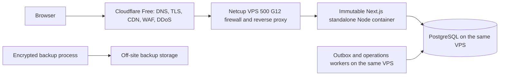

# ADR: Single production deployment target

- **Status:** Accepted architecture; implementation incomplete
- **Decision date:** 2026-07-16
- **Scope:** Production hosting, release path, data placement, background workers, and edge services

## Context

The repository has accumulated artifacts and external status evidence for several
deployment systems. GitHub commit metadata shows deployments or build attempts
from Vercel, Cloudflare Workers, and GitHub Pages, and PR-03 added a GitHub
Actions workflow. Those systems are not the selected production architecture.
Multiple connected deployment paths make a source push capable of changing an
external environment without a single, reviewed release decision.

The original architecture map, production audit, remediation plan, and findings
addendum are point-in-time evidence. They remain unchanged and authoritative for
what was observed at their review commits:

- [`../../01_SYSTEM_ARCHITECTURE_AND_REPOSITORY_MAP.md`](../../01_SYSTEM_ARCHITECTURE_AND_REPOSITORY_MAP.md)
- [`../../02_PRODUCTION_SECURITY_AND_PERFORMANCE_AUDIT.md`](../../02_PRODUCTION_SECURITY_AND_PERFORMANCE_AUDIT.md)
- [`../../03_PRODUCTION_REMEDIATION_AND_PR_PLAN.md`](../../03_PRODUCTION_REMEDIATION_AND_PR_PLAN.md)
- [`../../04_DISCOVERED_SECURITY_FINDINGS_ADDENDUM.md`](../../04_DISCOVERED_SECURITY_FINDINGS_ADDENDUM.md)

This decision supersedes their unresolved hosting assumptions and the active
GitHub Actions design in PR-03. It does not rewrite their findings, evidence, or
historical verdicts.

## Decision

Production uses one deployment path:



### Production platform contract

The selected production plan is the Netcup VPS 500 G12 in the provider's x86
class with 64-bit capability; the separate VPS ARM64 product family is not
selected. The production operating-system family is Linux, the Docker/OCI
platform is `linux/amd64`, the expected in-container machine architecture is
`x86_64`, and the expected Node.js architecture is `x64`. The production
container libc is musl because the repository's production Dockerfile uses an
Alpine-based image.

This versioned contract defines the deployment target; it is not evidence that
a live VPS has already been provisioned or observed. Before the first
production deployment, the provisioned host must be checked read-only against
this contract in a separate checkpoint. Changing the provider plan,
architecture, or base-image libc requires an ADR update, new native-dependency
qualification, and new production-image smoke proof.

Authoritative sources (accessed 2026-07-23):

- [Netcup VPS overview and FAQ](https://www.netcup.com/en/server/vps)
- [Netcup VPS 500 G12 product](https://www.netcup.com/en/server/vps/vps-500-g12-iv-12m)
- [Docker multi-platform build documentation](https://docs.docker.com/build/building/multi-platform/)
- [Alpine Linux](https://www.alpinelinux.org/)

Cloudflare Free is retained only as the authoritative DNS and edge security/reverse-
proxy front door. Cloudflare Workers and Cloudflare Pages are not application
runtime or deployment targets. Edge-to-origin traffic must remain encrypted,
the Cloudflare proxy must be enabled for the public origin, and the Netcup
firewall must prevent public access to PostgreSQL and direct, spoofable access
to the application origin.

The reverse proxy is the only local ingress to the application runtime. It
overwrites untrusted forwarding headers and supplies a private canonical IP plus
constant-time application attestation. The application never treats
`cf-connecting-ip`, `x-forwarded-for`, `x-real-ip`, or `Forwarded` as identity.
The checked-in Nginx configuration accepts only official Cloudflare source
networks and the host application binds only to loopback.

The application is released manually from one verified Git commit and one
immutable image identity. A Git push must never deploy. A release operator must:

1. identify a clean, exact Git SHA on `main`;
2. execute the complete local verification record;
3. build the production image once on the trusted release host;
4. record the image digest and bind it to that Git SHA and the approved public
   origin;
5. transfer or pull that exact immutable image to the Netcup VPS;
6. run the separately approved migration and release sequence; and
7. retain sanitized evidence and the previous compatible image digest.

Mutable deployment tags such as `latest`, builds from a VPS working tree, and
provider-generated builds are prohibited release inputs. Web, outbox,
operations, and migration execution must all be tied to the same release SHA
and immutable runtime artifacts. Secrets are injected at runtime from root-
owned VPS configuration and are never embedded in the image or copied from a
retired platform.

PostgreSQL resides on the same Netcup VPS and is reachable only over a local or
private interface. Application, migration, and backup access must use distinct
least-privilege roles. Backups must be encrypted before leaving the VPS, stored
outside the VPS failure domain, monitored for freshness and failure, and proven
by periodic isolated restores. A backup file that has not passed a restore test
is not recovery evidence.

The outbox and operations workers remain mandatory production components. They
run on the Netcup VPS on their existing one-minute and five-minute schedules,
with single-flight behavior, bounded execution, journald-visible failures, and
an alert path independent of the failed job. They must not execute TypeScript
or dependencies from a mutable repository checkout.

The following are explicitly rejected as application build, hosting, preview,
or deployment systems:

- Vercel;
- Cloudflare Workers;
- Cloudflare Pages;
- GitHub Pages; and
- GitHub Actions.

GitHub remains source control and historical evidence storage only. Removal of
an external integration must preserve commit history, audit reports, sanitized
deployment metadata, and the record of why the integration was retired.

## Repository workflow

- GitHub remains the source-control system, with no GitHub Actions CI workflow.
- `npm run verify:release` is the mandatory repository-owned local release gate.
- A push must never trigger an automatic preview or production deployment.
- Remediation proceeds as one small, reviewable commit at a time.
- A production deployment requires a separate, explicit release instruction
  that names the verified Git SHA and immutable image identity.

## Capacity and cost targets

The initial design targets approximately 1,000 total customers/users, an
initial 50 concurrently active users, and later load-test evidence through
100–150 concurrent users. If measured CPU, memory, connection, disk, or latency
ceilings require it, the upgrade path is a larger VPS first and a separately
operated PostgreSQL service only when measured needs justify separating it.

The hosting budget target is near or below EUR 100 per year, excluding the
domain when necessary. These figures are engineering and economic targets, not
benchmarked capacity guarantees. H0 neither performs load testing nor provisions
Netcup infrastructure.

## Control disposition

```text
Repository static integrity controls: retained.
Hosted GitHub Actions CI: intentionally removed by architecture/workflow decision.
Pre-merge protected release gate: not satisfied.
Local release gate: implemented, subject to human enforcement.
```

Removal of hosted CI is a workflow/architecture decision, not a security
improvement. The local gate can be bypassed by a person and is not equivalent to
centrally enforced pre-merge protection.

## Current implementation gaps

Acceptance of this ADR is not evidence that the target is deployable. At the
decision commit, the repository still has these blockers:

- `docker/docker-compose.prod.yml` defines only PostgreSQL; it does not define
  the application, worker execution, or an immutable image reference.
- `docker/Dockerfile.security` contains the standalone web runtime but not the
  outbox, operations, or migration runtimes required by this decision.
- the production systemd units execute the web process and workers from the
  host repository with `node`, `npm`, and `tsx`, instead of an immutable release
  artifact;
- `scripts/system-orchestrator.sh` can install development dependencies, build,
  migrate, and start production from the host checkout;
- the current image build and scan commands default to `villa-app:latest`;
- the versioned reverse-proxy and trusted-ingress contract exist, but live
  Netcup firewall, Cloudflare Full (strict), AOP, and certificate evidence is
  still required;
- no automated encrypted off-site backup or restore-verification artifact
  exists;
- H0 removed the Vercel-specific commit fallback from build metadata, but the
  generated version file still embeds a wall-clock timestamp, so the repository
  must not claim reproducible images;
- the layered abuse-control contract is Cloudflare Free, Nginx, and
  PostgreSQL-backed authoritative limits for sensitive operations; the
  checked-in Nginx thresholds remain dry-run observation defaults until
  staging/load qualification;
- the canonical production hostname, backup target, RPO/RTO, origin firewall
  policy, and exact reverse-proxy configuration still require recorded evidence.

Until every relevant gap is closed and verified, the selected architecture is
**accepted but not production-ready**.

## Consequences

- There is one deliberate production path and no automatic deployment on push.
- Local verification is human-enforced. It is not continuous integration,
  pre-merge protection, or an independent release approval.
- Removing GitHub Actions means PR-03 remains historical repository evidence;
  it does not satisfy `REM-02` as an active mandatory CI control.
- The single VPS is a shared failure domain for the application, PostgreSQL,
  and workers. Encrypted off-site backups mitigate data recovery, not service
  availability.
- Cloudflare protects the origin only if direct-origin access is blocked and
  the forwarded-client-IP chain is configured and tested correctly.
- `NEXT_PUBLIC_SITE_URL` is a build input. An image built for another public
  origin cannot be promoted as the same production artifact.
- Database migrations are forward-only. Image rollback is permitted only when
  the previous image remains compatible with the migrated schema; otherwise
  recovery follows the approved backup/restore or fix-forward procedure.
- No release may claim hosted CI, staging equivalence, backup recovery, or
  production readiness without the corresponding current evidence.
